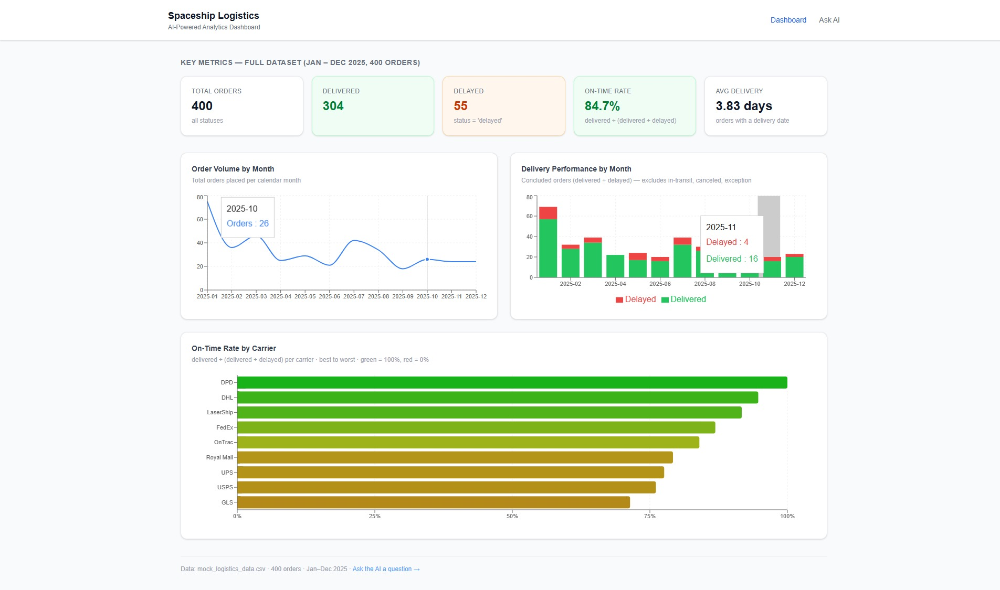
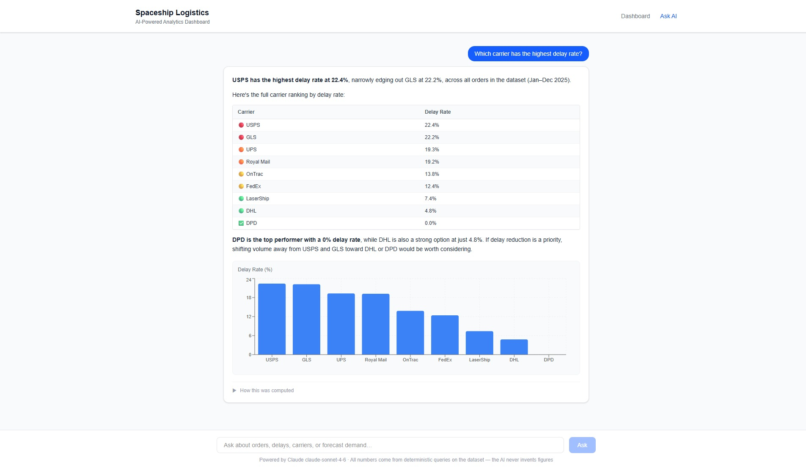
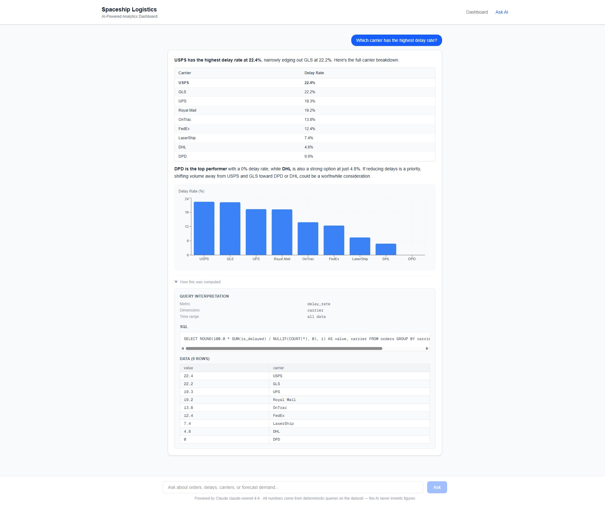
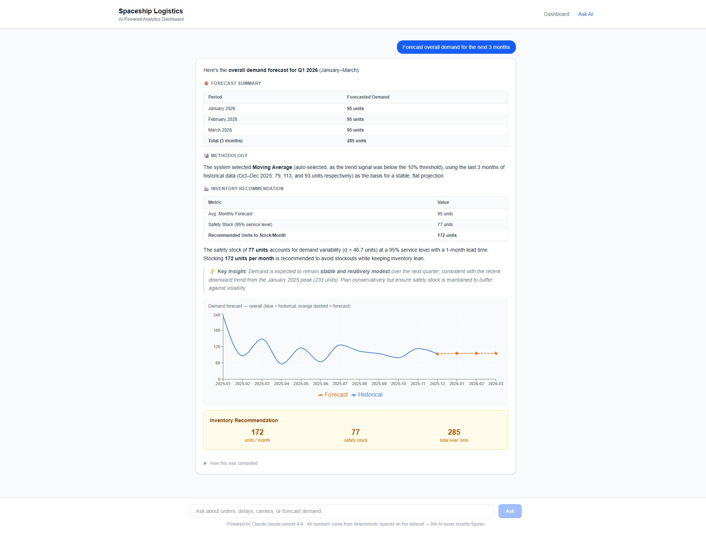

# AI-Powered Logistics Analytics Dashboard

A logistics analytics dashboard with three levels of intelligence over one unified dataset:

1. **Descriptive** — a KPI + chart dashboard.
2. **Diagnostic** — a natural-language interface that answers business questions *from the data*.
3. **Predictive/Prescriptive** — demand forecasting with an inventory recommendation.

**Live app:** https://spaceship-logistic-dashboard.vercel.app/
**Repository:** https://github.com/FX24/spaceship-logistic-dashboard

> **Guiding principle:** the AI layer routes and orchestrates — it is *never* the source of truth.
> The model interprets a question and chooses a tool with structured arguments; **all numbers come
> from deterministic computation over the dataset**, never from the model.



---

## 1. Quick start (local)

### Prerequisites
- **Node.js ≥ 24** — required for the built-in `node:sqlite` module (pinned in `engines`).
- An **Anthropic API key** — only needed for the natural-language `/chat` feature; the dashboard and
  forecasting work without it.

### Steps
```bash
# 1. Clone
git clone https://github.com/FX24/spaceship-logistic-dashboard.git
cd spaceship-logistic-dashboard

# 2. Configure env (only ANTHROPIC_API_KEY is required)
cp .env.local.example .env.local
#   then edit .env.local and paste your key

# 3. Install dependencies
npm install

# 4. (Optional) Regenerate the dataset artifact from the CSV
npm run seed        # parses data/mock_logistics_data.csv → src/lib/db/dataset.json (committed)

# 5. Run
npm run dev         # http://localhost:3000
```

### Environment variables
| Variable | Required | Purpose |
|---|---|---|
| `ANTHROPIC_API_KEY` | Yes (for `/chat`) | Authenticates calls to Claude for NL query routing. |

`.env.local` is gitignored — **never commit your key**. On Vercel the same variable is set under
Project → Settings → Environment Variables.

### Other commands
| Command | Description |
|---|---|
| `npm run dev` | Local dev server. |
| `npm run seed` | Re-parse the CSV → regenerate `src/lib/db/dataset.json`. |
| `npm run build` / `npm start` | Production build / serve. |
| `npm run lint` | ESLint. |
| `npm test` | Run the test suite (Node's built-in runner via `tsx`). |

### Testing
Tests use **Node's built-in test runner** (`node:test`) executed through `tsx` — no extra test
framework dependency. Coverage focuses on the parts where correctness matters most:

- `test/forecast.test.ts` — moving average, OLS linear regression, method auto-selection, and the
  inventory-recommendation formula.
- `test/queryBuilder.test.ts` — time-range resolution (`last_month`, etc.), parameterized SQL
  generation, allow-list enforcement, and chart inference.
- `test/definitions.test.ts` — UTC date math and the business-rule derived fields.
- `test/kpis.test.ts` — **end-to-end** against the committed dataset: asserts the KPI reference
  numbers (400 / 304 / 55 / 84.7% / 3.83 days) by loading `dataset.json` into the in-memory SQLite DB.

```bash
npm test
```

### Docker
A multi-stage `Dockerfile` builds the Next.js **standalone** output into a slim, non-root Node 24
image (Node 24 is required for the built-in `node:sqlite`). The dataset is bundled at build time, so
the container is self-contained.

```bash
# Build and run (dashboard works with no key; /chat needs the key)
docker build -t logistics-dashboard .
docker run -p 3000:3000 -e ANTHROPIC_API_KEY=sk-ant-... logistics-dashboard

# Or with Docker Compose (reads ANTHROPIC_API_KEY from your shell or a .env file)
docker compose up --build
```

Then open http://localhost:3000. The API key is passed **at runtime only** — it is never copied into
the image (`.env*` is excluded via `.dockerignore`).

---

## 2. Architecture

### Overview
A single Next.js (App Router) + TypeScript app, deployed as one Vercel project (UI + API routes
together). State is read-only: the CSV is the source of truth, parsed once at seed time into a
committed JSON artifact, loaded at runtime into an in-memory SQLite database.

| Concern | Choice | Why |
|---|---|---|
| Framework | Next.js 16 + TypeScript | One deployable for frontend + API. |
| UI | Tailwind CSS v4 | Lightweight styling, no component runtime. |
| Charts | Recharts | Declarative, dynamic chart selection. |
| Data | `node:sqlite` (built-in, Node 24) | Zero native deps → no Vercel build complexity. |
| AI | Anthropic Claude (`claude-sonnet-4-6`) tool use | Fast, capable routing at low cost. |
| Validation | Zod | Every tool input validated before it touches the DB. |

### The three separated layers
```
AI interpretation  →  Data computation  →  Business logic / presentation
(src/lib/ai)          (src/lib/db,           (src/lib/db/definitions.ts,
                       src/lib/tools,          src/components)
                       src/lib/forecast)
```
- **AI interpretation** is the only place the LLM runs. It outputs *structured args*, never SQL or numbers.
- **Data computation** maps validated args to pre-approved, parameterized SQL and runs it. All numbers
  originate here.
- **Business logic** defines domain rules once (`src/lib/db/definitions.ts`) and renders the result.

A **Zod validation gate** sits between layers 1 and 2, so a wrong or adversarial model output can only
ever be *invalid args* (rejected) — never a bad query or a fabricated figure.

### Key design decisions
- **No raw AI-generated SQL.** The model never writes SQL. `src/lib/db/queryBuilder.ts` holds allow-list
  maps (metrics, dimensions, operators); the model's strings only *select a key*, and every user value
  is passed as a bound parameter (`?`). Injection is structurally impossible, and the DB is opened
  read-only and in-memory.
- **Structured query generation.** The model's entire output contract is one small typed shape:
  `{ metric, dimensions[], filters[], timeRange?, granularity? }` — all enums. This is validatable,
  bounded, explainable, and portable (swap SQLite for Postgres by editing the builder, not the prompt).
- **Single source of truth for business rules** (`src/lib/db/definitions.ts`): the dashboard, NL
  queries, and seed pipeline all read the same `RULES` constants — no drift.
- **`node:sqlite` over a native driver** to avoid native-build issues on Vercel; isolated to
  `src/lib/db/connection.ts` so it can be swapped for WASM `sql.js` if a host lacks Node 24.

### Data flow (one NL question)
```
Browser → POST /api/chat
  → Round 1: Claude picks a tool + fills structured args   (interpretation only)
  → Zod validates the args                                 (reject if invalid)
  → queryBuilder → parameterized SQL → node:sqlite         (deterministic computation)
  → Round 2: Claude narrates the real result               (no calculation)
  → Response: { answer, chartSpec, queryPlan, rows }
Browser renders: answer (markdown) + chart + "how this was computed" panel
```

---

## 3. AI approach

A natural-language question returns a direct answer, an auto-selected chart, and an explainability panel:



### How questions are interpreted
The orchestration (`src/lib/ai/router.ts`) is a **two-round Claude tool-use loop**:

1. **Round 1 — routing.** Claude receives the question + the tool definitions and a system prompt. It
   responds with `stop_reason: "tool_use"`, choosing one tool and filling its structured arguments.
   *No numbers are produced here.*
2. **Validate + execute.** The args are parsed with Zod, turned into parameterized SQL by the query
   builder (or fed to the forecaster), and run against the in-memory DB. This is where real figures come from.
3. **Round 2 — narration.** The same conversation is sent back with a `tool_result` block containing
   the computed JSON. Claude writes the prose answer *using the numbers it was handed*.

If a question isn't analytical (e.g. "what can you do?"), `stop_reason !== "tool_use"` and Claude's text
is returned directly — no DB access.

### How tools are selected
The model chooses between two tools (defined in `src/lib/ai/tools.ts`):

| Tool | When | Structured input |
|---|---|---|
| `query_analytics` | Counts, delivery performance, delay/on-time rates, breakdowns, trends, KPIs. | `{ metric, dimensions[], filters[], timeRange, granularity }` |
| `forecast_demand` | Predicting future demand / inventory planning. | `{ target, horizon, method }` |

### Explainability (every answer)
The response always surfaces: the **filters/time range used**, the **metric and dimensions**, the
**query plan** (validated args + exact SQL + bound params), and the **underlying data table** — so a
reviewer can confirm every figure was computed, not guessed.



### Forecasting
`forecast_demand` aggregates monthly quantity from the dataset and applies a **basic** method:
- **Moving average** (last 3 months) for stable series.
- **Linear regression** (OLS) when a trend signal exceeds 10% of the mean.
- `method: "auto"` picks between them; the choice is reported in the methodology note.

It returns the historical + forecast series (for a combined chart), an **inventory recommendation**
(`recommended = ⌈avg × lead_time + safety_stock⌉`, where `safety_stock = z₉₅ × σ`, 1-month lead time,
95% service level), and a plain-language methodology explanation. Targets: `"overall"` or any
`product_category`.



---

## 4. Business rules

Defined once in `src/lib/db/definitions.ts`. There is no promised/SLA date in the data, so outcomes are
read from each order's explicit `status`:

- **Delayed** = `status = 'delayed'` only (`exception` is *not* counted as delayed).
- **On-time delivery rate** = delivered ÷ (delivered + delayed). `in_transit` / `canceled` / `exception`
  are excluded from the denominator.
- **Average delivery time** = `AVG(delivery_days)` over rows with a delivery date.
- **Total orders** = `COUNT(*)` (includes canceled).

Reference sanity checks: delivered 304, delayed 55, on-time 84.7%, avg 3.83 days.

---

## 5. Assumptions & simplifications
- Delivery outcome is read from `status` (no SLA/promised date exists in the dataset).
- 30 orders have no `delivery_date` and are excluded from average delivery time.
- Dates are treated as UTC calendar dates; "last month" = the previous full calendar month.
- Forecasting is monthly-granularity only, with no seasonality decomposition.
- The dataset is 400 mock orders for 2025 — not production scale; the DB is rebuilt in-memory per cold start.

---

## 6. Limitations (unsupported queries)
- **Per-SKU forecasting** is not supported — the data is too sparse (~1 order per SKU). Forecasting is
  by `product_category` or `overall`.
- `query_analytics` supports a fixed set of metrics/dimensions/filters; questions outside that set are
  declined gracefully rather than answered by guessing.
- No multi-turn memory — each chat question is independent.
- No real-time data or mutations — the dataset is read-only.

---

## 7. Future improvements
- Query history and result caching.
- Broader test coverage (e.g. the AI router with a mocked Anthropic client, component tests).
- Seasonality-aware forecasting (e.g. Holt-Winters).
- Broader query coverage (e.g. revenue time series, SKU-level filters).
- Clarification prompts for ambiguous questions.

---

## 8. AI usage disclosure
- This project was **built with the assistance of Claude Code** (Anthropic) for scaffolding, code, and
  documentation.
- The application's `/chat` feature uses **Claude (`claude-sonnet-4-6`)** via the Anthropic API for
  natural-language routing only — Claude selects a tool and fills structured arguments. **It never
  computes or invents the figures shown**; all numbers come from deterministic queries over the dataset.

---

## 9. Project structure
```
data/
  mock_logistics_data.csv      # provided dataset (read-only source of truth)
  csv.ts                       # tiny CSV parser (no dependency)
  seed.ts                      # CSV → validate (Zod) → src/lib/db/dataset.json
src/
  app/                         # Next.js App Router
    page.tsx                   # dashboard (descriptive) — server component
    loading.tsx                # dashboard loading state
    layout.tsx                 # root layout + global styles
    globals.css                # Tailwind v4 entry
    chat/page.tsx              # natural-language interface (diagnostic + predictive)
    api/
      chat/route.ts            # NL orchestration endpoint → src/lib/ai/router.ts
      kpis/route.ts            # dashboard KPI/chart data endpoint
  components/
    KpiCard.tsx                # KPI tile
    charts/                    # dashboard charts (OrderVolume, DeliveryPerformance, CarrierDelay)
    ChatInterface.tsx          # chat UI + markdown answer renderer
    DynamicChart.tsx           # auto-selected line/bar/pie for chat answers
    ForecastChart.tsx          # historical + forecast line chart
    Explainability.tsx         # "how this was computed" panel
  lib/
    ai/                        # router.ts (two-round loop), tools.ts, systemPrompt.ts
    tools/                     # queryAnalytics.ts, forecastDemand.ts, kpis.ts (deterministic)
    db/                        # connection.ts, queryBuilder.ts, definitions.ts (rules), dataset.json
    forecast/                  # methods.ts — moving average / linear regression + inventory math
    schemas/                   # analytics.ts, forecast.ts, order.ts (Zod schemas for tool I/O)
test/                          # node:test suites (forecast, queryBuilder, definitions, kpis)
Dockerfile                     # multi-stage standalone build (Node 24 Alpine, non-root)
docker-compose.yml             # convenience wrapper (docker compose up --build)
.dockerignore                  # keeps build context / secrets out of the image
```
